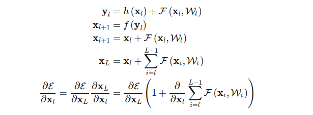

# Resnet
## 1.Resnet要解决的是什么问题
ResNets要解决的是深度神经网络的“退化”问题。

什么是“退化”？

我们知道，对浅层网络逐渐叠加layers，模型在训练集和测试集上的性能会变好，因为模型复杂度更高了，表达能力更强了，可以对潜在的映射关系拟合得更好。而“退化”指的是，给网络叠加更多的层后，性能却快速下降的情况。

训练集上的性能下降，可以排除过拟合，BN层的引入也基本解决了plain net的梯度消失和梯度爆炸问题。如果不是过拟合以及梯度消失导致的，那原因是什么？

按道理，给网络叠加更多层，浅层网络的解空间是包含在深层网络的解空间中的，深层网络的解空间至少存在不差于浅层网络的解，因为只需将增加的层变成恒等映射，其他层的权重原封不动copy浅层网络，就可以获得与浅层网络同样的性能。更好的解明明存在，为什么找不到？找到的反而是更差的解？

显然，这是个优化问题，反映出结构相似的模型，其优化难度是不一样的，且难度的增长并不是线性的，越深的模型越难以优化。

有两种解决思路，一种是调整求解方法，比如更好的初始化、更好的梯度下降算法等；另一种是调整模型结构，让模型更易于优化——改变模型结构实际上是改变了error surface的形态。

ResNet的作者从后者入手，探求更好的模型结构。将堆叠的几层layer称之为一个block，对于某个block，其可以拟合的函数为F(x)，如果期望的潜在映射为H(x)，与其让F(x) 直接学习潜在的映射，不如去学习残差H(x)−x，即F(x):=H(x)−x，这样原本的前向路径上就变成了F(x)+x，用F(x)+x来拟合H(x)。作者认为这样可能更易于优化，因为相比于让F(x)学习成恒等映射，让F(x)学习成0要更加容易——后者通过L2正则就可以轻松实现。这样，对于冗余的block，只需F(x)→0就可以得到恒等映射，性能不减。

## 2.Residual Block的设计
F(x)+x构成的block称之为Residual Block，即残差块，如下图所示，多个相似的Residual Block串联构成ResNet。

一个残差块有2条路径F(x)和x，F(x)路径拟合残差，不妨称之为残差路径，x路径为identity mapping恒等映射，称之为”shortcut”。图中的⊕为element-wise addition，要求参与运算的F(x)和x的尺寸要相同。所以，随之而来的问题是，
#### 2.1 残差路径如何设计？

在原论文中，残差路径可以大致分成2种，一种有bottleneck结构，即下图右中的1×1 卷积层，用于先降维再升维，主要出于降低计算复杂度的现实考虑，称之为“bottleneck block”，另一种没有bottleneck结构，如下图左所示，称之为“basic block”。basic block由2个3×3卷积层构成，bottleneck block由1×1

#### 2.2 shortcut路径如何设计？
shortcut路径大致也可以分成2种，取决于残差路径是否改变了feature map数量和尺寸，一种是将输入x原封不动地输出，另一种则需要经过1×1卷积来升维 or/and 降采样，主要作用是将输出与F(x)路径的输出保持shape一致，对网络性能的提升并不明显，两种结构如下图所示，

#### 2.3 Residual Block之间怎么连接？

至于Residual Block之间的衔接，在原论文中，F(x)+x经过ReLU后直接作为下一个block的输入x。

## 3.ResNet 网络结构
ResNet为多个Residual Block的串联，下面直观看一下ResNet-34与34-layer plain net和VGG的对比，以及堆叠不同数量Residual Block得到的不同ResNet。

ResNet的设计有如下特点：

+ 与plain net相比，ResNet多了很多“旁路”，即shortcut路径，其首尾圈出的layers构成一个Residual Block；
+ ResNet中，所有的Residual Block都没有pooling层，降采样是通过conv的stride实现的；
+ 分别在conv3_1、conv4_1和conv5_1 Residual Block，降采样1倍，同时feature map数量增加1倍，如图中虚线划定的block；
+ 通过Average Pooling得到最终的特征，而不是通过全连接层；
+ 每个卷积层之后都紧接着BatchNorm layer，为了简化，图中并没有标出；

**ResNet结构非常容易修改和扩展，通过调整block内的channel数量以及堆叠的block数量，就可以很容易地调整网络的宽度和深度，来得到不同表达能力的网络，而不用过多地担心网络的“退化”问题，只要训练数据足够，逐步加深网络，就可以获得更好的性能表现。**
下面为网络的性能对比:

## 4.error surface对比
上面的实验说明，不断地增加ResNet的深度，甚至增加到1000层以上，也没有发生“退化”，可见Residual Block的有效性。ResNet的动机在于认为拟合残差比直接拟合潜在映射更容易优化，下面通过绘制error surface直观感受一下shortcut路径的作用.

可以发现：

+ ResNet-20（no short）浅层plain net的error surface还没有很复杂，优化也会很困难，但是增加到56层后复杂程度极度上升。对于plain net，随着深度增加，error surface 迅速“恶化”；
+ 引入shortcut后，error suface变得平滑很多，梯度的可预测性变得更好，显然更容易优化；

## 5.Residual Block的分析与改进
论文[Identity Mappings in Deep Residual Networks](https://arxiv.org/abs/1603.05027)进一步研究ResNet，通过ResNet反向传播的理论分析以及调整Residual Block的结构，得到了新的结构，如下

**注意，这里的视角与之前不同，这里将shortcut路径视为主干路径，将残差路径视为旁路。**

新提出的Residual Block结构，具有更强的泛化能力，能更好地避免“退化”，堆叠大于1000层后，性能仍在变好。具体的变化在于

+ **通过保持shortcut路径的“纯净”，可以让信息在前向传播和反向传播中平滑传递，这点十分重要。**为此，如无必要，不引入1×1卷积等操作，同时将上图灰色路径上的ReLU移到了F(x)路径上。
+ 在残差路径上，**将BN和ReLU统一放在weight前作为pre-activation，**获得了“Ease of optimization”以及“Reducing overfitting”的效果。

下面具体解释一下。

令h(xl)为shortcut路径上的变换，f为addition之后的变换，原Residual Block中f=ReLU，**当h和f均为恒等映射时，可以得到任意两层xL和xl之间的关系，此时信息可以在xl和xL间无损直达，如下前向传播中的xl以及反向传播中的1。**

反向传播中的这个1具有一个很好的性质，任意两层间的反向传播，这一项都是1，可以有效地避免梯度消失和梯度爆炸。如果h和f不是恒等映射，就会让这一项变得复杂，若是令其为一个大于或小于1的scale因子，反向传播连乘后就可能导致梯度爆炸或消失，层数越多越明显，这也是ResNet比highway network性能好的原因。需要注意的是，BN层解决了plain net的梯度消失和爆炸，这里的1可以避免short cut 路径上的梯度消失和爆炸。

shortcut路径将反向传播由连乘形式变为加法形式，让网络最终的损失在反向传播时可以无损直达每一个block，也意味着每个block的权重更新都部分地直接作用在最终的损失上。看上面前向传播的公式，可以看到某种ensemble形式，信息虽然可以在任意两层之间直达，但这种直达其实是隐含的，对某个block而言，它只能看到加法的结果，而不知道加法中每个加数是多数，从信息通路上讲尚不彻底——由此也诞生了DenseNet。

对于残差路径的改进，作者进行了不同的对比实验，最终得到了将BN和ReLU统一放在weight前的full pre-activation结构。

## 6. 小结

ResNet的动机在于解决“退化”问题，残差块的设计让学习恒等映射变得容易，即使堆叠了过量的block，ResNet可以让冗余的block学习成恒等映射，性能也不会下降。所以，网络的“实际深度”是在训练过程中决定的，即ResNet具有某种深度自适应的能力。

深度自适应能解释不会“退化”，但为什么可以更好？

通过可视化error surface，我们看到了shortcut的平滑作用，但这只是结果，背后的根由是什么？

也许彻底搞懂ResNet还需要进一步地研究，但已有很多不同的理解角度，

+ 微分方程的角度，[A Proposal on Machine Learning via Dynamical Systems](https://link.springer.com/article/10.1007/s40304-017-0103-z)
+ ensemble的角度，[Residual Networks Behave Like Ensembles of Relatively Shallow Networks](https://arxiv.org/pdf/1605.06431.pdf)
+ 信息/梯度通路的角度，[Identity Mappings in Deep Residual Networks](https://arxiv.org/abs/1603.05027)
+ 类比泰勒展开、类比小波……

[原文地址](https://www.cnblogs.com/shine-lee/p/12363488.html)