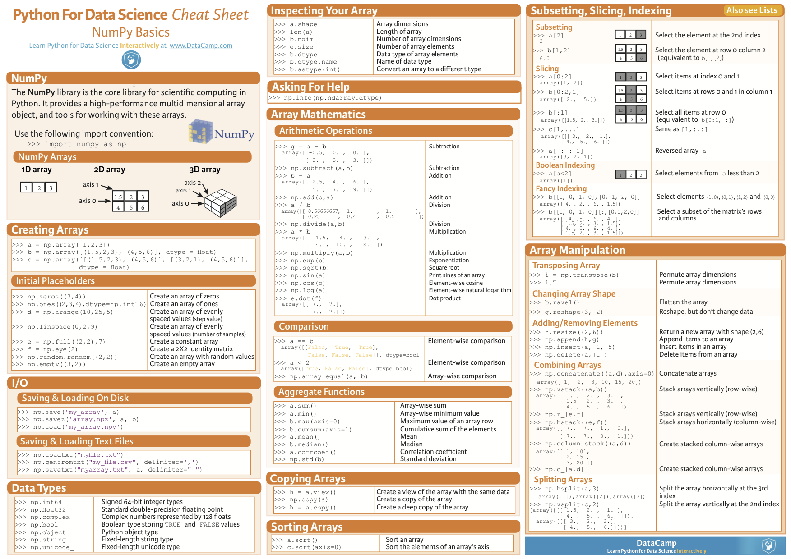

# AI Cheatsheets

## [Check all AI Cheatsheets PDF](./PDFs/All%20Cheat%20Sheets.pdf)

## [DASK详细请见](https://dask.org/)

## [dplyr详细请见](https://dplyr.tidyverse.org/)

## [ggplot](https://ggplot2.tidyverse.org/reference/ggplot.html)

## [keras](https://keras.io/)

## [matplotlib](https://matplotlib.org/)

## Neural Network Cells

## Neural Network Graphs

## Neural Networks Zoo

## [numpy](https://numpy.org/)

## [pandas](https://pandas.pydata.org/)

## [pyspark](https://spark.apache.org/docs/latest/api/python/)

## [Scikit Learn](https://scikit-learn.org/stable/)

## [Scipy](https://scipy.org/)

## [seaborn](https://seaborn.pydata.org/)

